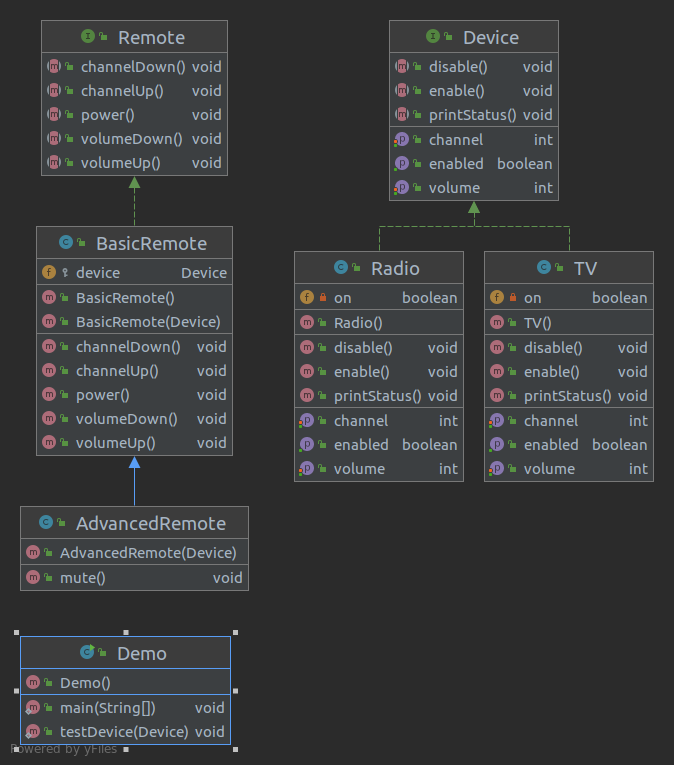

### Bridge in Java
* Bridge is a structural design pattern that __divides business logic or huge class into separate class hierarchies that can be developed independently__.
* __One of these hierarchies (often called Abstraction) will get a reference to an object of second hierarchy (Implementation)__.
* The abstraction will be able to delegate some (sometimes, most) of its calls to the implementations object.
* Since all implementations will have a common interface, they'd be interchangeable inside the abstraction.

### Usage of Bridge pattern in Java
* __The Bridge pattern is especially useful when dealing with cross-platform apps, supporting multiple types of database servers or working with several API providers of a certain kind (for example, cloud platforms, social networks, etc).__
* __Identification: __ Bridge can be recognized by a clear distinction between some controlling entity and several different platforms that it relies on.

### Bridge between devices and remote controls
* This example shows separation between the classes of remote and devices that they control.
* __Remotes act as abstractions, and devices are their implementation__.
* __Thanks to common interfaces, the same remotes can work with different devices and vice versa.__
* The Bridge pattern __allows changing or even creating new classes without touching the code of opposite hierarchy.__

### Class Diagram
