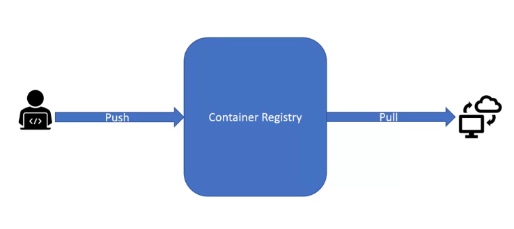
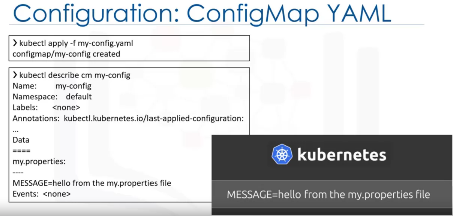
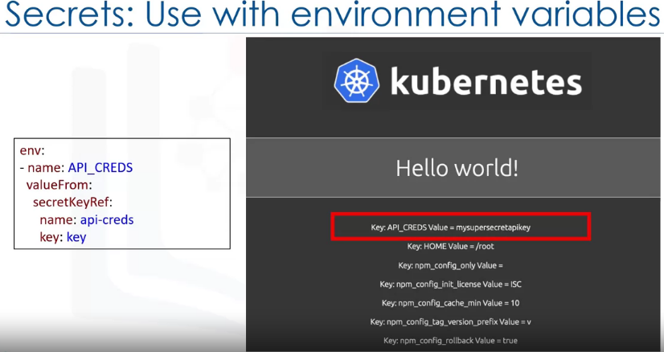

## Most common docker cli commands
Each of these command start with `docker`.
| Syntax   | Description                                     |
| -------- | ----------------------------------------------- |
| Command  | Usecase                                         |
| `build`  | Creates container images. Requires a Dockerfile |
| `tag`    | Name images. Doesn't overwrite existing image.  |
| `images` | List all images.                                |
| `run`    | Runs a container.                               |
| `push`   | Stores images in remote location.               |
| `pull`   | Retrieves images from remote location.          |

## Docker as a container runtime


## Benefits of container
* A Dockerfile serves as a blueprint for an image.
* An image is an immutable file that contains everything necessary to run an application.
* Images are templates for containers.
* A container is a running image. These are mutable.

## Image layers
* Images are built using instructions in a Dockerfile.
* Each Docker instruction creates a new read-only layer.
* A writable layer is added when an image is run as a container.
* Layers can be shared between images.


## Dockerfile instructions (Image layers)
* FROM: 
  * define base image.
  * Starting point.
* RUN: 
  * Executes commands.
  * For example, we can run bash command here.
* ENV: 
  * Sets environment variables in the image.
* ADD and COPY:
  * Copy files and directories in the image.
  * COPY: can copy from local directories.
  * ADD: can also copy from remote url.
* CMD:
  * Define default command for container execution.
  * There will be only one CMD command. If we add more CMD, it will only execute the last one.

## A Dockerfile Inspection2
```docker
FROM ubuntu: 18.04
COPY ./app
RUN make/app
CMD python/app/app.py
```
* FROM: defines base image (ubuntu: 18.04)
* COPY: Copys current directory work to `./app` directory.
* RUN: Runs a make operation to build the applicaiton.
* CMD: Provides a default mechanism for running this container.

## Container registry
- Storage and destribution of named container images.
- Public or private.
- Hosted or self-hosted. 

### Image naming
- `hostnamee/repository:tag`
- repository: group of related images.
- tag: version number
- example: `docker.io/ubuntu:18.04`
  
### Build Context
- build the image: `docker build -t my-app:v1 .`
- This command will build the context: set of files used for generating the image.

- To verify image creation we run: `docker images`.
- To tag the same image with new tag we run: `docker tag my-app:v1 second-app:v1`. Here image id is same.
- After running the `docker images` once again:

- After creating image we can run a container by running: `docker run my-app:v1`.
- After running the container we can push it to the registry by running: `docker push my-app:v1`. If we login to dockerhub we will be able to see that.


## Container Orchestration
Manage the lifecycle of containers, especially in large, dynamic environments.
- Provisioning and deployment.
- Availability.
- Scaling.
- Scheduling to infrastructure.
- Rolling updates.
- Health checks.


## Kubernetes
- **It is a portable, extensible, open-source platform** for managing containerized workloads and services that facilitates both declarative configuration and automation.
- It has a large, rapidly growing ecosystem.
- Kubernetes services, support and tools are widely available.
- It is open source.
- Designed for container orchestration platform.
- Facilitates declerative management.
- Posses a growing ecosystem.
- Widely available.

## What Kubernetes is not
- NOt a traditional, all inclusive platform as a service (PAAS).
- Does not limit the types of applications.
- Does not deploy source code or build applications.
- Does not prescribe logging, monitoring, or alerting solutions.
- Does not provide built-in middleware, databases, or other services.

## Kubernets Architechture
- Deployment of a kubernetes is called cluster.

- **Kubernetes API server(kube-api-server):**
  - **Exposes the Kubernetes API**.
  - All communication in the cluster utilizes this API.
- **etcd:**
  - **Highly available key-value store**.
  - **Contains all the cluster data**.
  - Source of truth for the state in a Kubernetes cluster.
- **Kubernetes scheduler(kube-scheduler):**
  - Assigns newly created pods to nodes.
- **Kubernetes controller manager(kube-controller manager):**
  - **Runs all the controller processes**.
  - Controller monitor the cluster state.
  - Controller ensures the **actual state matches the desired state**.
- **Cloud controller manager:**
  - Runs controllers that interact with underlying cloud providers.
  - Links clusters into a cloud provider's API.
- **Nodes(kuelet+kube-proxy):**
  - The worker machines in Kubernetes.
  - May be a virtual or physical machine.
  - Manged by control plane.
  - **Nodes are created by cloud providers not kubernetes itself.**
- **Kubelet:**
  - Communicates with the API server.
  - Ensure that Pods and their associated containers are running.
  - Reports to the control plane on health and status.
- **Container runtime:**
  - Downloads images and runs containers.
  - Kubernets implements an interface so that this component is pluggable.
  - Docker is a well-known runtime.
- **Kubernetes Proxy:**
  - Network proxy.
  - Maintains network rules that allow communication to Pods.
- **Control loop:**
  - A non terminating loop that regulates the state of a system.
- **Controllers:**
  - Monitor the state of cluster.
  - Take action to ensure the actual state matches the desired state.
  - Communicate with the API server to initiate these actions.
  - Track kubernetes objects and esure that the state is achieved.

## Kubernetes objects
- Persistent entities in Kubernetes.
- Define the desired state for you workload.
- Use the kubernetes API to work with them.
  - kubectl cli.
  - client libraries.
- Consist of two parts: spec and status

### Namespaces and names
- **Namespaces:** 
   
  - **is virtualization of physical cluster**.
  - Segregate cluster by team, proejct, etc.
  - Necessary with larger numbers of users.
  - Provide a scope for object names.
- **Names:**
  - Each object has a name.
  - Names are unique for a resource type within a namespace.

### Labels and Selectors
- **Labels:**
   
  - Key/value pairs attached to the objects.
  - Intended for identification of objects.
  - Not unique.
  - Organize and group objects.
- **Selectors:**
  - Identify and group a set of objects.


## Basic Kubernetes objects
  - **Pod:**
    - **Simplest unit in Kubernetes**.
        
    - Represents processes running in your cluster.
    - Encapsulates a container (or sometimes multiple).
    - Replicating a pod serves to scale an application horizontally.
    - Generally we use yaml file to create pod.
    - In the following screenshot: 
      - __kind__ represents type which is Pod.
      - __spec__ represents the configuration of the object. 
        - Pod spec must contain at least one container.
        - Here the container name is `nginx`.
        - `containerPort` represents the list of open ports of the container.

  - **Replicaset:**
    - **Maintains a set of identical Pods**.
       
    - Definition consists of :
      - `replicas` represents number of replicas.
      - `template` represents number of Pod template. 
      - `selector` represents core grouping. It is used to identify which Pods it can acquire. `labels` are not unique, so selector is used for grouping.
    - Generally encapsulated by a deployment.
    - Responsible for counting pods and ensuring the appropriate number of pods exist.

  - **Deployment**
    - **Provides updates for Pods and Replicasets**.
     
    - Runs multiple replicas of our application.
    - Suitable for stateless applications.
    - **One key feature that Replicaset does not provide but Deployment provides is Update triggers a rollout/Rolling update**.
    - The rolling update scales up the new version to 3 replicas and scales down the old version to 0 replicas.
    - **Deployment object is responsible for orchastrating the rollout of new version.**

## Kubectl(Kubecontrol) CLI
- **Key tool for working with Kubernetes**.
- Provide functionality for working with clusters and workloads running on clusters.
- Several different command types including **declarative and imperative**.

  - **Imperative commands:**
    - Quickly create, udpate and delete Kubernetes objects.
    - Easiest to learn.
    - for example: `kubectl run nginx --image nginx`. This command will run an image as a container.
      - But it doesn't provide and audit trail.
      - Not very flexible since there is no configuration file.
  - **Imperative commands using template:** 
    - Use configuration template.
    - **Specify an operation such as create, replace or delete**.
    - for example: `kubectl create -f nginx.yaml`.
      - But specifying the operation is a limitation of this model.
      - Here if the first developer makes an update operation using this template and it does not merge. Then if the second developer tries to use the udpate operation it won't work because the previous changes are not merged.
  - **Declative Commands:**
    - **Configuration files define one or more objects**.
    - No operation is specified:
      - Needed operations are inferred by kubectl.
    - Works on files and directories.
    - Configuration files define desired state, and kubernetes acutalizes that state.
    - **Decalarative commands work better on directories but imperative commnads work better on files**.
    - **Imperative commands work better in development but the declarative commands are recommended in prodution**.
    - for example: `kubectl apply -f nginx/`
    - for example: `kubectl apply -f file.yaml`

## Using Kubernetes
  
  - Bread and butter command: `kubectl apply -f file.yaml`.
  - `apply` command can be run on file or directory.
  - When `apply` command is run the state of the targeted kubernetes cluster is made to match the state that is provided in file.
  - This is fully declarative. The user doekubernetes
  
  ### Viewing resources
  
  - get command: lists one or many resources.
    ```
    kubectl get deployments --namespace kube-system
    ```
  - describe command: shows details of a one or many resources.
    ```
    kubectl describe deployments kube-dns-amd64 --namespace kube-system
    ```
  - `kube-system` is an object created by kubernetes. It is a namespace.
  
  
  


## Replica Sets
- Replace pods for redundancy: Replace or Renew pods if one is failing/deleted.
- Maintain desired state.
- Supersede replicacontroller.
- **One of main philosophy of kubernetes is to keep each object type independent of others**.
- Loosely coupled yet interconnected.
- Connected using labels.


- While it is possible to create a Replicaset without a deployment, it is recommended to create a deployment instead.


## Autoscaling
* ReplicaSet works with a set number of pods.
* __Horizontal Pod Autoscaler (HPA) enables scaling up and down as needed__.
* Can Configure based on desired state of CPU, memory etc.

In the above, it can be described as: The min number of pod is=2 and max is=5 and a new pod will be create if the overall cluster usage is 10%.

Horizontal pod autoscalar is created automatically behind the scene

* We can also manually create horizontal pod autoscalar if we want:


## Rolling Updates
* Replicaset and autoscaling are important to minimize downtime and service interruptions.
* __Rolling updates are a way to roll out changes in an automated and controlled fashion throughout our pods__.
* Work with pod templates such as deployments.
* __Allow for rollback if something goes wrong__.
* Adding liveness and readiness:
  
* Adding rolling update strategy:
  
  - Here want to create 10 pods(see `replicas`).
  - `maxUnavailable: 50%` represents: We want 50% of the pods be always available.
  - `maxSurge:2` represents: There can only be two additional pods that we define previously in order to finish rollout.
  - We could also set `maxUnavailable: 0%` for 0 down time system.
  - Setting `maxSurge: 100%` would essentially mean doubling the number of pods and creating a complete replica for taking the original set down after the rollout is complete.
  - `minReadySeconds: 5` represents waiting a number of seconds before moving on the next pod in the rollout stage.
- Current State:
  
  - We have created a deployment having 3 pods in the replicaset.
  - And our application run and says: 'Hello World!'.
- Changing versions:
  
  - Uploading new image to Docker Hub:
    
  - Applying the version update to this new image:
    
  - Rolling out to v2:
    
  - Rolling out to the previous version (v1):
    
  - Rolling out status of version v1:
    

## ConfigMaps and Secrets
  ### ConfigMaps:
  - Used to override configuration for deployments: Give us a way to provide configuration data, so we don't need to hardcode data in application code.
  - Reusable across deployments.
  - Created in a couple of different ways:
    - **Using String literals**.
    - **Using an exisiting properties or "key"="value" file**.
    - **Providing a ConfigMap YAML descriptor file**. Both the first and second ways can help us create such a YAML file.
  - Multiple ways to reference from pod/deployment:
    - **Reference as an environment variable**.
    - **Mount as a volume**.
  - ConfigMap Current state: We want to pass `PORT` and `MESSAGE` externally.
    
  - Passing configuration through Environment variables.
    
  - Applying the environment variable change:
    
  - Configmap string literal from file:
    
  - Get deployment descriptor output :
    
  - Config Map properties file:
    
  - Get deployment descriptor output :
    
  - Configuration passed using ConfigMap YAML :
    
  - Applying ConfigMap YAML :
    

  ### Secrets
  - **Environment variable based:**
    - Creating secret :
       
    - Printing the secret in yaml format:
       
    - Using deployment descriptor:
       
  - **Volume mounts based:**
    - Using Volume mount:
      
      - Another way to use secret key in our application is to volume mount.
      - First we create the secret we created previously.
      - Next in the descriptor YAML file, we need to have a volume for the Secret with a corresponding volume mount.
      - Each container in the descriptor file will have its own volume mount but can share the volume itself.
      - In this case our `api-creds` Secret will be mounted as a file at `/etc/api/api-creds`.
      - The program that needs the file will have to read and extract the secret.
  
## Service Binding
  - Allows us to bind and IBM cloud service instance to Kubernetes Cluster.
  - The service credentials are available as Secrets to any application deployed on the cluster.
  - By mounting the Kubernetes secret as a volume to our deployment, we make the IBM cloud identity and Access management(IAM) API key available to the container that runs in our pod.
  - A JSON file called binding is created in the volume mount directory.

## Kubernete Ecosystem
- Kubernetse is not all-inclusive platform as a service.
  - Provides a more flexible model rather than a more opinionated one.
- The ecosystem provides many services that Kubernetes does not.
  - Building container images.
  - Storing images in a container registry.
- Additional examples are logging, monitoring and CI/CD.
- CNCF compnay hosts Kubernetes.
- Cloud Native interactive landscape is another resource provided by CNCF.

  ### CNCF landscape
  - CNCF hosts a variety of projects in addition to Kubernetes.
  - Many other non-CNCF projects exist in the ecosystem too.
  - Current needs for cloud-native development are addressed by tools in the ecosystem.
    - Provides greater developer choice.

## Red Hat OpenShift
- **Red Hat OpenShift is a hybrid cloud, enterprise kubernetes application platform.**
- **Hybrid cloud**: Can be run on premises or in public and private clouds.
- **Kubernets**: An underlying technology.
- **Application platform**: Provides additional tooling for applications.

  ## Kubernetes and OpenShift
  - K8s is a crucial component of Openshift.
  - Openshift is an extension of K8s.
  - **Openshift builds on Kubernetes to provide a more comprehensive container platform**.
  - Openshift provides logging, monitoring, container registry, and other features.

## Introduction to Red Hat Openshift
 
- **Origin Kubernetes Distribution (OKD):**
  - Upstream Kubernetes distribution embedded in OpenShift.
  - **Adds developer and operations-centric tooling on top of Kubernetes**.
  - **Analogy: Kubernetes is the kernel, Openshift is the distribution.**
  - Red Hat packages OKD with other software, resources and official support to create Red Hat OpenShift Container Platform.
  - **OKD is open source and OpenShift is a product with official support.**

## Red Hat OpenShift VS Kubernetes
- **Similaraties:**
  - **Kubernetes capabilities**:
    - There are many similarities between Openshift and kubernetes because Openshift is built with Kubernetes.
    - Native Kubernetes capabilities are also present in Openshift.
  - Container orchestration tool.
  - Both are open source softwares.
- **Differences:**
  - OpenShift: Product, Kubernetes: Project. OpenShift is supported by RedHat.
  - CLI: oc versus kubectl.
  - Web UI
  - Deployment objects:
    - DeploymentConfig vs Deployment.

## Challenges with microservices:
- Security:
- Encrypt traffic between services.
- Canary deployments.
- A/B testing.
- Cascading failures.
- Retries.
- Circuit breaking.

## Service Mash:
- **A dedicated layer for making service-to-service communication fast, secure and reliable.**
- **Traffic management, Security and Observability:**  It provides traffice managment to control the flow of traffic between services, security to encrypty traffic between services and observability of service behavior so we can troubleshoot and optimize applications.

## Istio:
- Commonly used service mash.
- It's platform independent but it's often used on Kubernetes.
- Istio meets all the crieteria of our service mesh definition.
- Connect or traffic management enables Istio to intelligently control the flow of traffic between services, which in turn enables canary deployments, A/B tests and other deployment models.
- Istio secures services through authentication, authorization, and encryption.
- Istio provides control by defining policies that can be enforced accross an entire fleet.
- With Istio we can observe traffic flow on the mesh so we can inspect Api calls and dependencies and we can view metrics such as latency and errors.
 
 
 
 