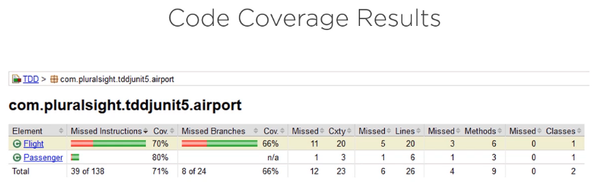
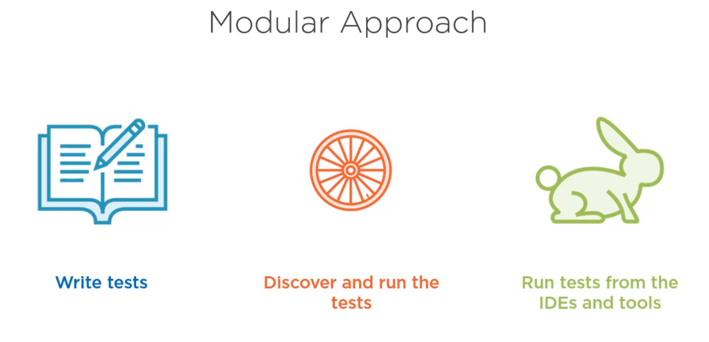
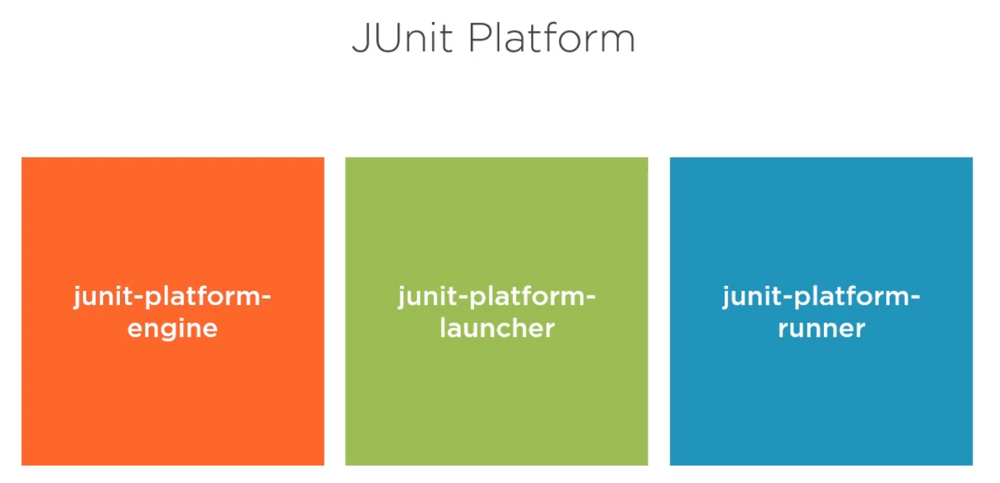

## Version check
- **The course is applicable for**
  - JUnit 5 (5.0.1)
  - Java 8
  - Jacoco 0.8.7
- Not application to JUnit 5.8.2

## Is your application doing what it is supposed to do?
- If anyone ask you is your application doing what is supposed to do? What will be the answer?
- How would you justify your answer?
- If the application has been manually tested many times by different users we may have some certainty that is is working the expected way. But how much time will be involved and how many people my be involved to do the testing?
- What about the newly introduced features? When will you expect them to be verified?
- Would you wait for weeks or even months until the verification process will be fulfilled?
- Wouldn't it be better if somehow atleast some of the verification will be automatically made from the time of writing code to be sure from the beginning that we are addressing  our goals?
- This is where TDD comes in action and provides a helping hand.

## TDD Benefits
- **Driven by clear goals**
  - We will be sure that we will address exactly what our application needs to do.
- **Safe Code**
  - Our code will be safer.
  - We will be able to prevent the introduction of bugs.
  - The long debugging hours will greatly diminish.
- **Isolate incorrect code**
  - We can quickly isolate the piece of code where we have to make the investigation.
- **Easily introduce new functionality**
  - Introducing new functionality will be much faster.
  - This will drive us to implement the code that will do what it is supposed to do.
  - This will also prevent us introducing bugs into the well-working existing code.
- **Documenting the application**
  - Tests will act as documentation for the applciation.
  - We may follow them and understand what problem our code is supposed to solve.

## Code Production Lifecycle

- **Classical approach**
  - **Step-1:** We write code.
  - **Step-2:** Do some testing by observing its behavior.
  - **Step-3:** Do some debugging in case things are not working well.
  - **Step-4:** Again we write code.
  - **Step-5:** Agian do some testing by observing its behavior.
  - **Step-6:** Agian do some debugging in case things are not working well.
- **This may be a tedious process and the testing will need some dedicated time, testing scenario and individual focus of running tests and checking results.**
- A testing scenrio may vary from one developer to another and the way one checks  the results may also be particular from one person to another.

## Isolate Incorrect Code

- Even if a developer has discovered the bug now he is facing another challenge, which is the piece of code that produces it. How to be able to isolate those lines that are generating it?
- How can we find that magic that finds the incorrect code as tight as possible?
- What will tell us that we are doing the wrong way and not to continue further, but to inspect the small portion of the application that is at the origin of the bad behavior?
- **The well-written tests are the expected answer.**

## Easily Introduce New functionality
- 
-  Any living application will receive requests for implementing new functionality.
-  In order to implement we must follow some questions
   -  What behavior we should follow?
   -  What if we will first implement the test that will show me what i have to do. Then i may think about how i have to do it.
   -  This is infact one of the fundamental principles of the test-driven development.

## Document the applicaiton
- What is this software suppose to do?
- Most programmers prefer to work with the code, and this is pretty natural.
- Well written unit tests do exactly this. They invoke our code and consequently they provide working specification of our functionality.
- As a result unit test efficitively become a significant portion of the technical documentation.

## Our approch -> Move an application to TDD using JUnit5
- **Non-TDD working application as input.**
- **Write unit tests for the existing code.**
  - Writing tests that initially fail, then writing the code that fixes the test.
- Working cycle, write tests for the new functionality, then implement it.

# Code Coverage
- A mesure used to describe the degree to which the source code of a program if executed when a particular test suit runs.
- A program with a high test coverage, measured as a percentage, has more of a source code executing during testing. Which suggests it has a lower chance of containing undetected software bugs compared to a program with low test coverage.
- Many different methods can be used to calculate test coverage:
  - **Percent of program methods and percentage of program lines execution:** This is the most basic.

## Code Coverage Tools
- The matrix is built by a tool that runs the test suite and analyzes the code that is effectively executed as a result.
- Among the most widely-used code coverage tools:
  - 
  - **JCov:** Originally developed and used with Sun JDK, and later Oracle JDK, from the very beginning of Java.
  - **OpenClover:** As a free and open source successor of Atlassian Clover which reached it's end of line in 2017.
  - **EMMA:** As an open-source toolkit for measuring and reporting. It is no longer in active development since Jacoco has been designed to replace it. However it is still popular and pretty large in use.
  - **JaCoCo:** An open-source toolkit initially developed as a plugin for Eclipse. It has a good integrartion with Gradle and Maven and under continuous development.
  - **JaCoCo code coverage for classes:**
    - 
  - **JaCoCo code coverage for methods:**
    - 
  - **JaCoCo code coverage for a particular class on lines:**
    -   

## What code coverage percentage is feasible?

- **80%:** 
  - It is the minimum percentage that is required by most of the projects. 
  - Most customers and techinal leads consider this as a minimum in order to accept that the delivered code is reliable.
  - It is included into the definition of done
- **90%:**
  - In most cases achieveable but it may require some extra effort and artifices to be truely feasible.
  - The difference between 85% and 90% may be much larger than that one between 80% and 85%.
- **100%:**
  - It should be our goal.

## 100% code coverage does not mean our code works perfectly

For at least two reasons our code might now work perfectly:
  - **First reason:** Our test might not be good enough.
  - **Second reason:** 
    - We are still at the level of unit testing. 
    - It means we are testing units, meaning classes and their methods.
    - We are testing neither the interaction between different classes, nor the possible scenarios for using the application.

# JUnit Architecture

## JUnit 4 Architecture
- The Junit, as released in 2006, provided a simple and monolithic architecture.
- 
- **A single JAR file:**
  - All it's functionality is concentrated inside a single JAR file.
  - Despite it's apperant simplicity, this has generated a series of problems that are stronger and stronger as the time was passing.
- **No flexible API:**
  - The fact that the provided API was not flexible made the IDE and tools that were using JUnit tightly coupled.
  - This tools needed to go into the internals of the JUnit classes and even use reflection in order to get the needed information.
- **Used by everyone:**
  - As the same single JAR was used by everyone and all toolset and IDEs were so tightly coupled with, the possibilities of evaluation of JUnit have been seriously reduced.
  - Changing any private variable or method could have broken the ones using it.

## Modular Approach (New Approach)
- 
- The logical seperation of concern required an API to write tests dedicated mainly to the developers.
- A mechanism for discoverning and running the tests.
- An API to allow the easy interaction with IDEs and tools and run the tests from them.

## JUnit 5 modules

- **JUnit Platform:** 
  - Serves as a foundation for launching testing framworks on the JVM.
  - It also provides an API to launch tests from either the console, IDEs or build tools.

- **JUnit Jupitar:**
  - It is the combination of the new programming model and extension model for writing tests and extensions in JUnit 5.
  - The name has been chosen from the fifth planet of our solar system, which is also the largest one.

- **Junit Vintage:**
  - Provides the test engine for running JUnit3 and JUnit 4-based tests on the platform, ensuring the necessary backwards compatibility.

### JUnit Platform
- 
- **junit-platform-commons:**
  - It is an internal common library of JUnit intended solely for usage within the JUnit framework itself.
  - Any usage by external parties is not supported.
- **junit-platform-console:**
  - It provides support for discovering and executing tests on the JUnit Platform from the console.
- **junit-platform-console-standalone:**
  - It is an executable JAR with all dependencies included.
  - It is used by a console launcher, a command-line java application that lets us launch the JUnit Platform from the console.
  - It can be used to run JUnit vintage and JUnit jupiter addresses and print test execution results to the console.

- 
- **junit-platform-engine:**
  - It is a public API for test engines.
- **junit-platform-launcher:**
  - It is a public API for configuring and launching test paths, typically used by IDEs and build tools.
- **junit-platform-runner:**
  - It is a runner for executing tests and test suites on the JUnit platform in a JUnit 4 environment.

- 
- **junit-platform-suite-api:**
  - It contains the annotations for configuring test suites on the JUnit Platform.
- **junit-platform-surefire-provider:**
  - It provides support for discovering and executing tests on the JUnit platform using Maven Surefire.
- **junit-platform-gradle-plugin:**
  - It provides support for discovering and executing tests on the JUnit platform using Gradle.

### JUnit Jupiter

- **junit-jupiter-api:**
  - It is used for writing tests and extensions.
- **junit-jupiter-engine:**
  - It is a test engine implementation only required at runtime.
- **junit-jupiter-params:**
  - It provides support for parameterized tests in JUnit Jupiter.
- **junit-jupiter-migrationsupport:**
  - It provides migration support for JUnit 4 to JUnit jupiter.
  - It is required only for running selected JUnit 4 roles.

### JUnit Vintage

- **junit-vintage-engine:**
  - The engine implementation to execute tests that are written in JUnit 3 or JUnit 4.