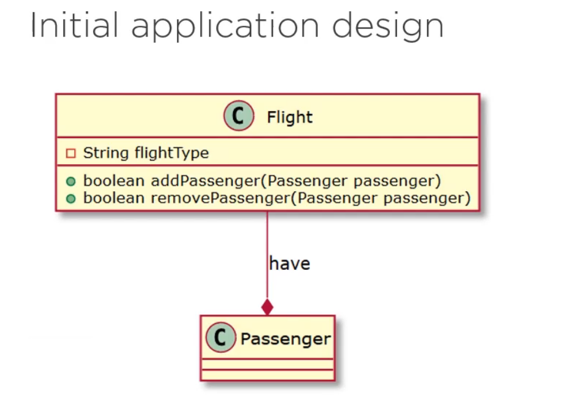
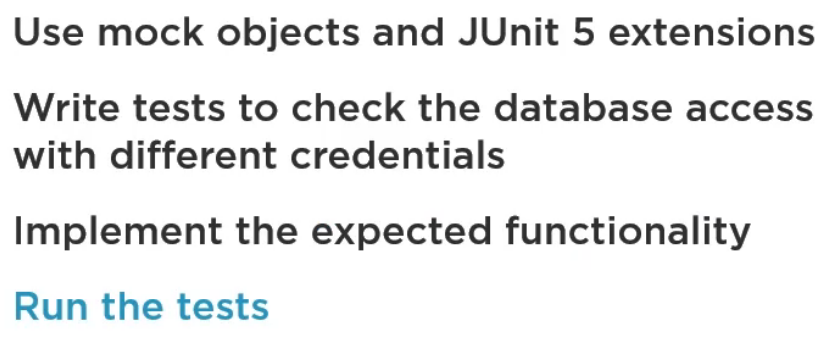

# Flight Management Application
## Adding Passenger Business Logic

- We are assuming we are joining a program to manage flights and passengers.
- The company maintains supports regarding adding and removing a passenger to a flight.
- The flight may be of a few types, economy and business are known at the time. Later we can add more.
- If the flight is an economy one, both VIP passengers and user ones may be added to it.
- If the flight is a business one, only VIP passengers may be added to it.

## Removing Passenger Business Logic

- A usual passenger may be removed from a flight but a VIP passenger can not be removed.

## Initial Application Design

- We maintain a field called flightType inside the Flight class. Based on it's value we have to write the behavior of the `addPasanger` and `removePassenger` methods.
- The programmer will have to focus on decision making at the level of the code of these two methods.

## Things to do in this application

## About Jacoco integration
- https://docs.gradle.org/current/userguide/jacoco_plugin.html
- https://reflectoring.io/jacoco/
- To verify coverage run `./gradlew build jacocoTestCoverageVerification`.
- To see the coverage report run `./gradlew build jacocoTestReport
`.
- To see the test run `./gradlew test`

## Code coverage
- 
- Currently we have overall code coverage of 73%.
- 
- Our Flight class code coverage is 71%.
- 
 - Our Passenger class code coverage is 80%.
 - We are willing to improve that.

## Improving code quality by polymorphism
- 
- The key for refactoring is to move the design to use polymorphism instead of procedural style conditional code.
- The principle that gets in action is called the Open/Close principal(OCP) of SOLID.
- Practically it means that the left-hand design will require changes to our existing class each time when we add the new `flightType`.
- These changes may reflect in each conditional decision, that is made based on `flightType`.
- Design from the right hand side as refactored by replacing conditional polymorphism, we don't need any `flightType` evaluation and any default value into the switch.
- **We can even add a new type called `PremiumFlight` by simply extending the base class and defining it's behavior inside it.**
- **We may still ask ourselves, how can we be sure we are doing the right thing?**
- The answer is simple. We can remember that, we have already introduced tests, they will provide us the safety that the already-implemented functionality is untouched.
- **The refactoring will be achieved by introducing one seperate class for each conditional type.**
- We may change `addPassenger` and `removePassenger` as abstract methods and delegate their affected implemented to the subclasses.
- We introduced 3 types of `Flight` classes: `EconomyFlight`, `BusinessFlight` and `PremiumFlight`.
- The `EconomyFlight` class methods do not contain conditional logic so they are simplified. The same for the `BusinessFlight` class.
- We also needed to change a little of as `Flight` class is now abstract and we instantiate the new Flight subclasses. 
- [Let's see the code](../../Pluralsight/TDD_with_JUnit5-Catalin-Tudose/flight-mgmt-app/flight-mgmt-app/src/main/java/com/shshetudev/flightmgmtapp/flight/Flight.java)

## What we have learned so far
- **TDD and it's benefits**
- **Code coverage**
- **JUnit 5**
- **Flight management application**
- **Add features TDD style using JUnit5**
  - **Real life simulation**

# Adding new features with TDD and JUnit5
Modules:
- Using JUnit 5 more effectively
- Introducing new features to the application
  - Business logic understanding
  - Activity diagrams
  - class diagrams
- Using JUnit5 new features
- Transpose scenarios in JUnit 5
- **Fixing tests implementing business logic**

## Using JUnit 5 more effectively
- **@Nested inner classes**
    - We can use `@Nested` to be applied to inner testing classes.
    - We can seperate the logic of testing at the level of inner classes.
- **@DisplayName and @BeforeEach**
  - In order to better control the logic and prove significant information to the once running the test we'll use the `@DisplayName` and `@BeforeEach` annotations.
  
  ## Introducing new features to the application
  - As a first new feature the company will introduce a new flight type, premium and the policy concerning this flight type.
  - **Business logic**
    - **Passenger add:** 
      - 
      - A VIP passenger should be added to the Premium flight, otherwise the request must be rejected.
    - **Passenger remove:**
      - 
      - Only VIP passenger can be removed at any time.
  - **OCP(Open/Close Principle):**
    - 
    - Earlier we have moved from procedural approach that was using conditional to the oop approach that is used polymorphism.
    - We have relied on the test in order to make sure we have moved the right direction and we are not affecting the existing functionality.
    - The OCP principle allows that already-existing code to be untouched. It is open for extension but closed for modification.

## TODO: Implementing TDD for PremiumFlight class
- **We will write the PremiumFlight class with dummy methods.**
- **Then we will follow the TDD cycle and write the test that are checking the new functionality.**
- **We will Run the tests - to be red.**
- **We will effectively add the code that implements the new functionality.**
- **Then we will run agian the test and expecting them to be green.**
- Please see the code base: `4-adding-premium-flight`
- Please see the code base: `5-refactoring-premium-flight`

## Adding Passenger only once
- **Problem:**
  - We presume they're aware of a few situations when, on purpose or by mistake the same passenger has been added to a flight more than once.
  - This has generated a few problems with the management of the places and this kind of situation must be avoided.
- **Solution:**
  - 
  - We have to make sure that whenever we try to add the passenger to the flight, if he has been previously added to the flight the request should be rejected.
  - **This is our new business logic and it will be our new challenge to be implemented in TDD style.**

## TODO: For adding Passenger only once
- **Write the tests checking the restriction.**
  - A passenger can be added to a flight only once.
- **Run tests - to be red**
  - Then we are going to run the test and we are expecting them to be red.
- **Effectively add the code that implements the restriction.**
  - Then we'll effectively add the code that implements this restriction.
- **Run the tests - to be green**
  - We are going to run the test and expecting them to be green.
- Please see the code base: `6-adding-passenger-only-once`

## TODO: Adding a policy for Bonus points
- 
- Our new policy states that bonus points are awarded to the passenger.
- We have to consider the mileage meaning the distance that is traveled by each passenger.
- The bonus will be calculated for all flights of the passenger and it depends on a factor.
- The milage will be divided by 10 for VIP passenger and by 20 for usual ones.
- **Approach**
  - **We write the tests checking the policy.**
  - **Run the tests-to be red.**
  - **Effectively add the code that implements the policy.**
  - **Run the tests-to be green.**
- **Code Walk through**
  - Please see the code base: `7-adding-a-policy-for-bonus-points`.
  - We add an new property `distance` and it's getters and setters to the `Flight` class.
  - As bonus will be calculated for all flights of the passengers we are going to introduce `Milage` class, that will keep the factor for usual passengers.
  - We are going to override `equals()` and `hashcode()` methods in `Passenger` class so that we can verify whether it's the same passenger or not.
  - We add `junit-jupiter-params` in `build.gradle` file for parameterized tests.
  - We add `MilageTest` class.
  - We add a method in `Milage` class named `addMilage()` and write the test method in `MilageTest` class.
  - In order to create the string we create a new class `FlightArgumentConverter`. We are adding some logics for parsing the csv format.

# TDD by Integrating JUnit5 with Mockito
What we are going to learn in step by step

## Introduction
- A programmer typically creates a mock object to test the behavior of some other objects.
- As the same way that the car designer uses a crash test dummy to simulate the dynamic behavior of a human in vehicle impacts.
- The Mockito framework allows the create of test double object or mock object.

## SUT and DOC

- `SUT` stands for System under test, 
- `DOC` stands for Dependent on components.
- So `SUT` is in a relationship with some `DOC`.
- We are interested in verifying how our `SUT` works, but not how the `DOC` works.
- Here two sides are too tightly coupled and we would like to cut off the strong dependency, `DOC`.

## Mock Objects

- Mock objects can simulate the behavior of complex real objects.
- Therefore useful when a real object, for example some `DOC` is impratical or impossible to incorporate into a unit test. 
- **Simulated object:** They are simulated objects that mimic the behavior of real objects in a controlled way.
- **Created to test others behavior:** They are created to test the behavior of some other objects that use them.
- **Simulate the behavior of complex, real objects:** Developing a program we may arrive to the situation when we will need to create mock objects, and also called doubles or substitutes, that simulate the behavior of complex, real objects in order to achieve our testing purposes.

## Purpose of JUnit5 Extensions

- **Extend the behavior of test classes or methods:** Purpose of JUnit5 Extensions The purpose of JUnit5 extensions is to extend the behavior of test classes or methods and these can be reduced for multiple tests.
- **Class implementing one or more interfaces:** 
  - To create the JUnit5 extension we need to define a class, which implements one or more interfaces.
  - For example, the test instance post processor extension is executed after an instance of a test has been created.
- **Injecting dependencies into the instance:** A typical use case for this extension is injecting dependencies into the instance.

## Use cases for Mock objects

There are few typical use cases for mock objects

- **Objects supplies non-deterministic results**
  - Mock object supplies non-deterministic results. for example, the current time or the current temperature.
- **States difficult to create or reproduce**
  - It has states that are difficult to create or reproduce, for example a network error.
- **It is slow**
  - For example, a database which would have to intialized and configured before the test.
- **Does not exist or may change behavior**
  - It does not exist or may change behavior.
  - We will have to make sure for our demo that some query to the database would always return the same results.
- **Include information and methods only for testing purposes**
  - It would have to include the information and methods exclusively for testing purposes, and not for its actual task.

## Implementing the Air conditioning functionality

- The air conditioning system relies on a few devices that need to be checked in order to trigger some action.
- We'll be able to make a decision after checking a sensor.
- If the sensor is blocked it means something really goes wrong into the system and will throw an exception.
- Otherwise if the sensor is working, it means that we may check the temperature provided by the thermometer.
  - If it is greater than a thershold we'll have to trigger the air conditioning system.
- As we can see we are right on some devices that would need to be installed and configured with some effort.
- More than this, the thermometer supplies some non-deterministic result.
- **So the temperature, a perfect use case for mock objects.**

## Relationship between components

- There is an air conditioning system.
- And it depends on the information received from a thermometer.
- Which in turn depends on the information received form a sensor.

## TODO: Implementing air conditioning functionality

- Please see the codebase `8-implementing-air-conditioning`.
- We would like to start the implementation of the air conditioning system in a TDD style and with the help of the Mockito and JUnit5 extensions.
- **Firstly,** we have to add mockito dependency into the pom.
- **Secondly,** we have to add the Mockito extension class to the project. This class can be found in Junit5 user guide.
- **Mockito extension class** is a use case of the Jupiter extension model, which implements the extension callbacks, `TestInstancePostProcessor`, `ParameterResolver`.
- We create two classes, `Sensor` and `Thermometer` where `Thermometer` class has a reference to a Sensor.
- In `Sensor` class we have `getTemperature()` method which works only when the sensor is not blocked. Otherwise, it has to throw a runtime exception.
- `ThermometerTest` class tests the behavior of the thermometer.
- Here we have to annotate the class with `@ExtendWith(MockitoExtension.class)`.
- As we do not use real sensor that's why we inject mocked `Sensor` in the `Thermometer` class.
-**First test**
  - Sets the behavior of the sensor to be unblocked.
  - Then we have to make sure the sensor has been injected into the thermometer.
  - Verifies the temperature, and verifies that the `isBlocked` method has been invoked exactly once.
- **Second test**
  - Sets the behavior of the sensor to be blocked.
  - Then we have to make sure the sensor has been injected into the thermometer.
  - Verifies that the runtime exception has been thrown, and verifies that the `isBlocked` method has been invoked exactly once.
- **AirconditioningSystem.java**
  - We use create this class for providing the real temperature and the air conditioning system will be triggered if the temperature exceeds a given threshold.
- **AirConditionSystemTest.java**
  - This class is used for testing the `AirConditioningSystem` class.
- After all the tests the code coverage is right now 95%. Since `Sensor` class is not covered.

## TODO: Implementing DB Access functionality

- We move further with a new functionality to implement for the flights company. It intends to set up a database to keep the data about its activities.
- A very important thing about choosing a database is providing its security.
- A database is a large system that needs to be installed and configured, a consuming time and resources activity.
- So untill some later phase of the development when we will afford to do all these things, we may think about providing a mock implementation of it.

## Relationship between components

- There is a credentials object, and it's successful access depends on the information that is received from a database.
- This one will be a `DOC`, **dependent on component**, and we will provide a mock implementation of it.

## We will follow these steps

- We will use mock objects and JUnit5 extensions.
- We write tests to check the database acess with different credentials.
- Implement the expected functionality.
- Run the tests and make them green.
- Please see `9-implementing-db-access-functionality`.

## Steps Implementation
- We have `Credentials` class containing usename and password.
- We have `Database` class provide a map of `registeredUsers` and a `login()` method.
- `login()` method will check the existence of some given credentials. But we do not have access to real database yet.
- So we can not populate the map of registered users.
- We also have a class named `DatabaseAccessTest`.
- For this application code coverage will be 85% and build will fail.

## Implement statistics functionality

- Here we will add three more methods `averageDistance()`, `minimumDistance()`, `maximumDistance()`

## Final Note
Finally what we have done is
